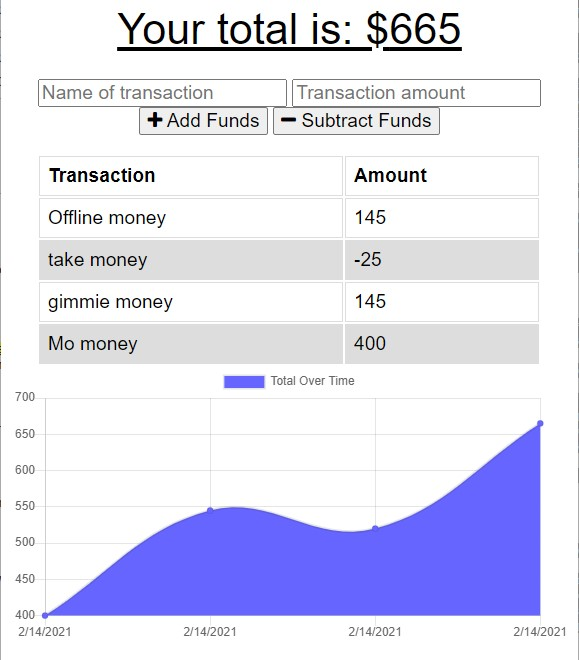

# Budget Tracker PWA
 



## Description
This budget tracker allows users to enter transactions for adding and subtracting funds as a way to keep track of your budget over time. Each transaction is graphed on a line chart as a means to visualize the transactions. The application includes offline functionality, which stores transactions if the application suddenly becomes offline, and sends them to the database upon re-connection. It utilizes the browsers indexedDB storage capabilities, and a service worker for caching website files while offline. It can also be used as a progressive web app, for installing on a desktop or mobile device.

The deployed application can be viewed [here](https://dry-thicket-44985.herokuapp.com/).

## Table of Contents
* [Installation Requirements](#install)
* [NPM Packages Used](#npm)
* [Application Usage](#usage)
* [Tests](#tests)
* [Questions](#questions)

## <a name=install></a>Installation Requirements

### <a name=npm></a>NPM Packages
* [compression](https://www.npmjs.com/package/compression) - compression
* [express](https://expressjs.com/) - web application framework
* [mongoose](https://mongoosejs.com/) - mongodb object modeling for node.js
* [morgan](https://www.npmjs.com/package/morgan) - HTTP request logger middleware

***

## <a name=usage></a>Application Usage
The application can be cloned from github using:
```
git clone git@github.com:yooperjb/budget_tracker.git
```
To the use the application MongoDB must be installed locally, or by using a service such at [MongoDB Atlas](https://www.mongodb.com/cloud/atlas). For testing purposes a local installation is recommended. The database settings are within the server.js file which will create and connect to the database described.

To run the application, from root use:
```
npm start
```
## Tests
No tests were completed yet for this application. 

## Questions
Any questions or feedback regarding this project can be sent directly to my [email](mailto:jason.barnes@humboldt.edu). This project and others can be found at my [Github page]('https://github.com/yooperjb').